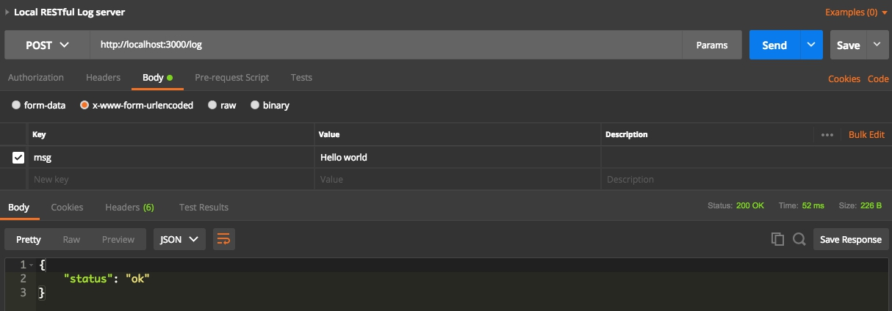

## Goals

When developing iOS notification service extensions, I always fail to set break point and print out any log in Xcode. So, I decide set up a local RESTful web service to receive log.

## Usage

Let `npm` install necessary libraries, execute `npm install` first..

```	
   npm install`
```


Then, setup RESTful web service.

```
   `node app.js`
```

Test by `POSTMan`, as following image.



